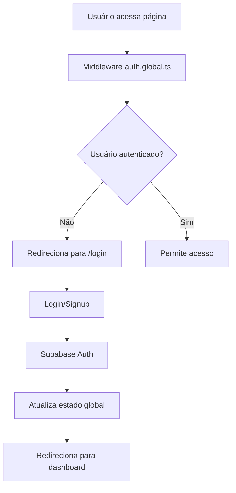

# Arquitetura Técnica - Sistema de Cadastro SaaS

## 🏗️ Visão Geral da Arquitetura

### Stack Principal
```
Frontend (Nuxt 4 SPA)
├── Vue 3 + Composition API + TypeScript
├── TailwindCSS + Design System Customizado
└── Middleware de Autenticação Global

Backend (Supabase)
├── PostgreSQL Database
├── Authentication & Authorization (RLS)
├── Real-time Subscriptions
└── Storage (futuro)
```

## 📁 Estrutura de Diretórios Detalhada

```
app/
├── components/                 # Componentes Vue reutilizáveis
│   ├── Base*.vue              # Componentes fundamentais (Button, Input, etc.)
│   ├── App*.vue               # Componentes específicos da app (Header, Footer)
│   └── [Entity]*.vue          # Componentes de entidade (FuncionariosTable)
│
├── composables/               # Lógica reativa compartilhada
│   ├── useAuth.ts            # Autenticação e estado do usuário
│   ├── use[Entity].ts        # Gerenciamento de entidades (useFuncionarios)
│   └── use[Feature].ts       # Features específicas
│
├── layouts/                   # Templates de layout
│   └── default.vue           # Layout padrão com header/footer
│
├── middleware/                # Middleware de rota
│   └── auth.global.ts        # Proteção global de autenticação
│
├── pages/                     # Páginas da aplicação (roteamento automático)
│   ├── index.vue             # Dashboard principal
│   ├── login.vue             # Página de login
│   └── [entity]/             # Páginas de entidades
│
├── plugins/                   # Plugins Nuxt
│   └── supabase.client.ts    # Configuração do cliente Supabase
│
├── types/                     # Definições TypeScript
│   ├── [entity].ts           # Tipos de entidades (funcionario.ts)
│   ├── api.ts                # Tipos de API responses
│   └── app.ts                # Tipos gerais da aplicação
│
└── assets/css/               # Estilos globais
    └── main.css              # Importações do TailwindCSS
```

## 🔧 Configurações Principais

### Nuxt Configuration (nuxt.config.ts)
```typescript
export default defineNuxtConfig({
  compatibilityDate: '2024-11-01',
  devtools: { enabled: false },
  ssr: false,                    // SPA mode para melhor UX
  modules: ['@nuxtjs/tailwindcss'],
  css: ['~/assets/css/main.css'],
  runtimeConfig: {
    public: {
      supabaseUrl: process.env.SUPABASE_URL,
      supabaseAnonKey: process.env.SUPABASE_KEY
    }
  }
})
```

### TailwindCSS Configuration
- Design system semântico completo
- Cores customizadas (laranja + preto/cinza)
- Utilitários CSS personalizados
- Sistema de tipografia estruturado

## 🔐 Sistema de Autenticação

### Fluxo de Autenticação


### Implementação do Middleware
```typescript
// app/middleware/auth.global.ts
export default defineNuxtRouteMiddleware((to) => {
  const { isAuthenticated, syncUserState } = useAuth()
  
  // Sincronizar estado do usuário
  syncUserState()
  
  // Rotas públicas
  const publicRoutes = ['/login', '/novocadastro']
  if (publicRoutes.includes(to.path)) {
    return
  }
  
  // Verificar autenticação
  if (!isAuthenticated.value) {
    return navigateTo('/login')
  }
})
```

### Composable de Autenticação
```typescript
// app/composables/useAuth.ts
export function useAuth() {
  const user = useState<User | null>('auth.user', () => null)
  const isAuthenticated = computed(() => !!user.value)
  
  async function signUp(email: string, password: string, userData: any) {
    // Implementação com Supabase
  }
  
  async function login(email: string, password: string) {
    // Implementação com Supabase
  }
  
  async function logout() {
    // Implementação com Supabase
  }
  
  function syncUserState() {
    // Sincronização automática do estado
  }
  
  return { user, isAuthenticated, signUp, login, logout, syncUserState }
}
```

## 💾 Gerenciamento de Dados

### Padrão de Composables para Entidades
```typescript
// app/composables/use[Entity].ts
export function useFuncionarios() {
  // Estados reativos
  const funcionarios = ref<Funcionario[]>([])
  const loading = ref(false)
  const error = ref<string | null>(null)
  
  // Operações CRUD
  async function fetchFuncionarios() {
    loading.value = true
    error.value = null
    try {
      const supabase = useSupabaseClient()
      const { data, error: fetchError } = await supabase
        .from('funcionarios')
        .select('*')
        .order('created_at', { ascending: false })
      
      if (fetchError) throw fetchError
      funcionarios.value = data || []
    } catch (err) {
      error.value = 'Erro ao carregar funcionários'
      console.error('Fetch error:', err)
    } finally {
      loading.value = false
    }
  }
  
  // Retorno reativo
  return {
    funcionarios: readonly(funcionarios),
    loading: readonly(loading),
    error: readonly(error),
    fetchFuncionarios
  }
}
```

### Schema do Database (Supabase)
```sql
-- Tabela de funcionários
CREATE TABLE funcionarios (
  id UUID PRIMARY KEY DEFAULT gen_random_uuid(),
  nome VARCHAR NOT NULL,
  email VARCHAR UNIQUE NOT NULL,
  cargo VARCHAR NOT NULL,
  departamento VARCHAR NOT NULL,
  salario DECIMAL(10,2) NOT NULL,
  data_admissao DATE NOT NULL,
  status VARCHAR DEFAULT 'ativo',
  created_at TIMESTAMP DEFAULT NOW(),
  updated_at TIMESTAMP DEFAULT NOW()
);

-- Row Level Security (RLS)
ALTER TABLE funcionarios ENABLE ROW LEVEL SECURITY;

-- Política de acesso (usuários autenticados)
CREATE POLICY "Funcionários acessíveis para usuários autenticados" 
ON funcionarios FOR ALL 
USING (auth.role() = 'authenticated');
```

## 🎨 Sistema de Componentes

### Hierarquia de Componentes
```
BaseButton.vue           # Componente fundamental
├── Variantes: primary, secondary, accent, outline
├── Tamanhos: sm, md, lg
└── Estados: loading, disabled

BaseInput.vue            # Input fundamental
├── Tipos: text, email, password, number
├── Estados: error, disabled, readonly
└── Validação: integrada

FuncionariosTable.vue    # Componente complexo
├── Estados: loading, error, empty
├── Responsividade: mobile-first
└── Interações: sort, filter (futuro)
```

### Padrão de Componente Complexo
```vue
<template>
  <div class="card-elevated">
    <!-- Estado de Loading -->
    <div v-if="loading" class="card-body">
      <div class="animate-pulse space-y-4">
        <!-- Skeleton loading -->
      </div>
    </div>
    
    <!-- Estado de Erro -->
    <div v-else-if="error" class="card-body text-center py-12">
      <div class="text-accent-error mb-4">
        <!-- Ícone de erro -->
      </div>
      <p class="text-body-md text-text-secondary">{{ error }}</p>
    </div>
    
    <!-- Estado Vazio -->
    <div v-else-if="!items.length" class="card-body text-center py-12">
      <!-- Estado vazio -->
    </div>
    
    <!-- Conteúdo Principal -->
    <div v-else class="overflow-x-auto">
      <!-- Tabela ou lista -->
    </div>
  </div>
</template>

<script setup lang="ts">
import { computed } from 'vue'
import { useEntity } from '~/composables/useEntity'

const { items, loading, error, fetchItems } = useEntity()

// Executar fetch ao montar componente
await fetchItems()
</script>
```

## 📡 Integração com Supabase

### Configuração do Cliente
```typescript
// app/plugins/supabase.client.ts
import { createClient } from '@supabase/supabase-js'

export default defineNuxtPlugin(() => {
  const config = useRuntimeConfig()
  
  const supabase = createClient(
    config.public.supabaseUrl,
    config.public.supabaseAnonKey
  )
  
  return {
    provide: {
      supabase
    }
  }
})
```

### Padrões de Acesso aos Dados
```typescript
// Acesso seguro ao cliente
const supabase = useSupabaseClient()
if (!supabase) {
  error.value = 'Erro de conexão com o banco de dados'
  return
}

// Operação com tratamento de erro
const { data, error: dbError } = await supabase
  .from('table_name')
  .select('*')

if (dbError) {
  throw new Error(`Erro na operação: ${dbError.message}`)
}
```

## 🚀 Performance e Otimização

### Estratégias de Performance
1. **SPA Mode**: Navegação rápida entre páginas
2. **Lazy Loading**: Componentes carregados sob demanda
3. **Computed Properties**: Cache automático de valores derivados
4. **ReadOnly Refs**: Prevenção de mutações desnecessárias

### Code Splitting
```typescript
// Componente lazy
const HeavyComponent = defineAsyncComponent(() => 
  import('~/components/HeavyComponent.vue')
)

// Página lazy
definePageMeta({
  layout: 'default',
  // Outros meta dados
})
```

## 🛡️ Segurança

### Camadas de Segurança
1. **Middleware Global**: Proteção de rotas no frontend
2. **RLS (Row Level Security)**: Proteção no database
3. **Validação Client-Side**: Feedback imediato ao usuário
4. **Sanitização**: Prevenção de XSS

### Validação de Dados
```typescript
// Validação no composable
function validateFuncionario(data: CreateFuncionario): string[] {
  const errors: string[] = []
  
  if (!data.nome?.trim()) errors.push('Nome é obrigatório')
  if (!data.email?.includes('@')) errors.push('Email inválido')
  if (data.salario <= 0) errors.push('Salário deve ser positivo')
  
  return errors
}
```

## 🧪 Testing Strategy (Futuro)

### Testes Planejados
```typescript
// Unit Tests - Composables
describe('useAuth', () => {
  it('should login user successfully', async () => {
    // Test implementation
  })
})

// Component Tests - Vue Test Utils
describe('BaseButton', () => {
  it('should emit click event', async () => {
    // Test implementation
  })
})

// E2E Tests - Playwright
test('should complete login flow', async ({ page }) => {
  // Test implementation
})
```

## 📈 Monitoramento e Logs

### Estratégia de Logging
```typescript
// Log estruturado
console.error('Operation failed:', {
  operation: 'fetchFuncionarios',
  error: error.message,
  timestamp: new Date().toISOString(),
  userId: user.value?.id
})
```

## 🔄 Deploy e CI/CD (Futuro)

### Pipeline Sugerido
```yaml
# .github/workflows/deploy.yml
name: Deploy
on:
  push:
    branches: [main]
jobs:
  build-and-deploy:
    runs-on: ubuntu-latest
    steps:
      - uses: actions/checkout@v3
      - name: Setup Node.js
        uses: actions/setup-node@v3
      - name: Install dependencies
        run: npm ci
      - name: Build
        run: npm run build
      - name: Deploy
        run: npm run deploy
```
