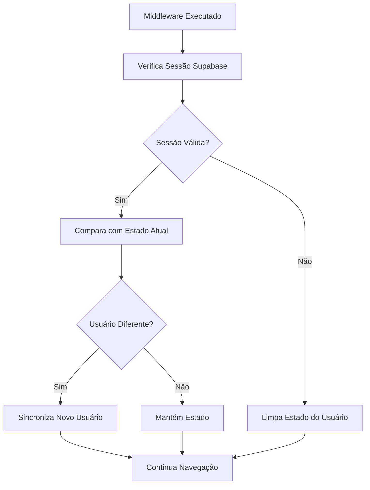

# 🔄 Middleware de Autenticação - Sincronização de Estado do Usuário

## ✅ Correção Implementada

O middleware `auth.global.ts` agora **sincroniza corretamente o estado do usuário** entre a sessão do Supabase e o composable `useAuth`.

### 🔧 **O que foi corrigido:**

#### **Antes (Problema):**
```typescript
// ❌ Verificava apenas a sessão, mas não sincronizava o estado
const { data: { session } } = await $supabase.auth.getSession()

// Estado do usuário no composable poderia ficar desatualizado
```

#### **Depois (Solução):**
```typescript
// ✅ Obtém o composable para sincronização
const { syncUserState, user } = useAuth()

// ✅ Verifica a sessão
const { data: { session } } = await $supabase.auth.getSession()

// ✅ Sincroniza o estado do usuário
if (session?.user) {
  if (!user.value || user.value.id !== session.user.id) {
    syncUserState(session.user) // Atualiza o estado
  }
} else {
  if (user.value) {
    syncUserState(null) // Limpa o estado
  }
}
```

## 🎯 **Funcionalidades Adicionadas:**

### 1. **Sincronização Inteligente**
- Compara o usuário atual com o da sessão
- Só atualiza quando necessário (evita re-renders desnecessários)
- Limpa o estado quando não há sessão

### 2. **Detecção de Mudanças**
- Detecta quando um usuário diferente fez login
- Sincroniza automaticamente o novo usuário
- Remove usuário quando a sessão expira

### 3. **Tratamento de Erros Melhorado**
- Em caso de erro crítico, redireciona para login por segurança
- Preserva acesso a rotas públicas mesmo com erros
- Logs detalhados para debug

## 🔄 **Fluxo de Sincronização:**



## 📱 **Benefícios da Correção:**

### ✅ **Estado Sempre Consistente**
- Composable `useAuth` sempre reflete a sessão real
- Componentes sempre mostram dados corretos do usuário

### ✅ **Navegação Inteligente**
- Redirecionamentos baseados no estado real
- Evita loops de redirecionamento

### ✅ **Experiência Suave**
- Usuário vê informações corretas imediatamente
- Transições suaves entre estados logado/deslogado

### ✅ **Segurança Robusta**
- Estado não pode ficar "fantasma" (usuário logado no estado mas sem sessão)
- Validação dupla: sessão + estado

## 🧪 **Como Testar:**

### 1. **Login/Logout**
```bash
# O estado do usuário deve sincronizar automaticamente
user.value // Sempre reflete a sessão atual
isAuthenticated.value // Sempre correto
```

### 2. **Navegação**
```bash
# Teste os redirecionamentos
/ → Verifica auth → Login se necessário
/login → Verifica auth → Home se já logado
```

### 3. **Sessão Expirada**
```bash
# Se a sessão expirar, o estado deve limpar automaticamente
# E redirecionar para login
```

## 🔍 **Debug:**

Para verificar a sincronização, observe no Console:
- Logs do middleware mostrando sincronização
- Estado do `user.value` sempre consistente
- Redirecionamentos acontecendo corretamente

O middleware agora garante que **o estado do usuário sempre corresponde à sessão real do Supabase**! 🎉
